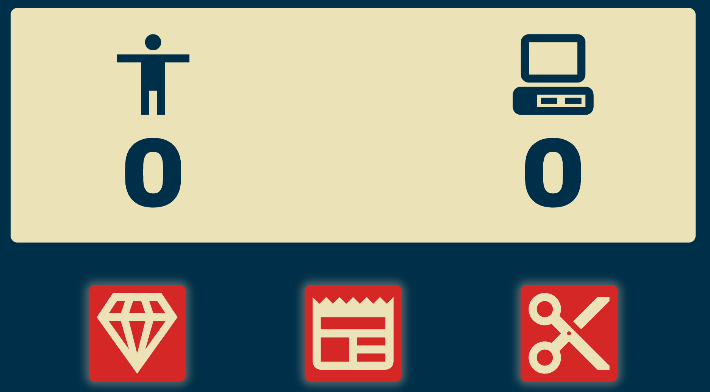

# foundations-rock-paper-scissors

An in-browser console game of paper, scissors, stone

# Preview

    

# Links

-[Assignment Page (May '24)](https://www.theodinproject.com/lessons/foundations-rock-paper-scissors)

-[Finished Project](https://erreurdesyntaxe.github.io/foundations-rps/)

# Notable Features

- Entertaining content
- Modal window
- Endless games
- Simple and pleasant design

# Challenges

- User input validation (when it was through the console)
- Comparing the computer's hand to the user's hand
- The general logic of the game
- Removing Event Listeners: can't use arrow functions

# Lessons

- removeEventListener doesn't work with anonymous functions
- Pasting < svg > directly in the HTML allows for easier styling

# Diary

My objective at this stage is to follow the guidelines explained in the problem solving lesson: understand the objectives, plan from the interface to the input and output and algorithms, write pseudocode, and divide tasks.

After learning some CSS and forgetting a lot of JavaScript, I have come back to redo this project. The difference between the two versions of the site is immense. Having just finished the play area and modal window, I hesitate to write a footer. I have accomplished what I wanted to do, and it feels like time would be better spent on something else.
