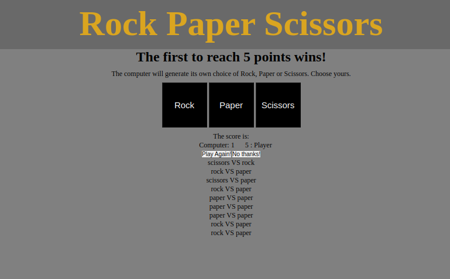

# foundations-rock-paper-scissors
An in-browser console game of paper, scissors, stone

# Preview

    

# Links

-[Assignment Page (Dec '23)](https://www.theodinproject.com/lessons/foundations-rock-paper-scissors)

-[Finished Project](https://erreurdesyntaxe.github.io/foundations-rock-paper-scissors/)

# Notable Features

-Interactive buttons  
-Starting a new game  

# Challenges

-User input validation (when it was through the console)  
-Comparing the computer's hand to the user's hand  
-The general logic of the whole program  

# Lessons

-The backend is difficult but more logical (?)  

# Diary

My objective at this stage is to follow the guidelines explained in the problem 
solving lesson: understand the objectives, plan from the interface to the input 
and output and algorithms, write pseudocode, and divide tasks.  